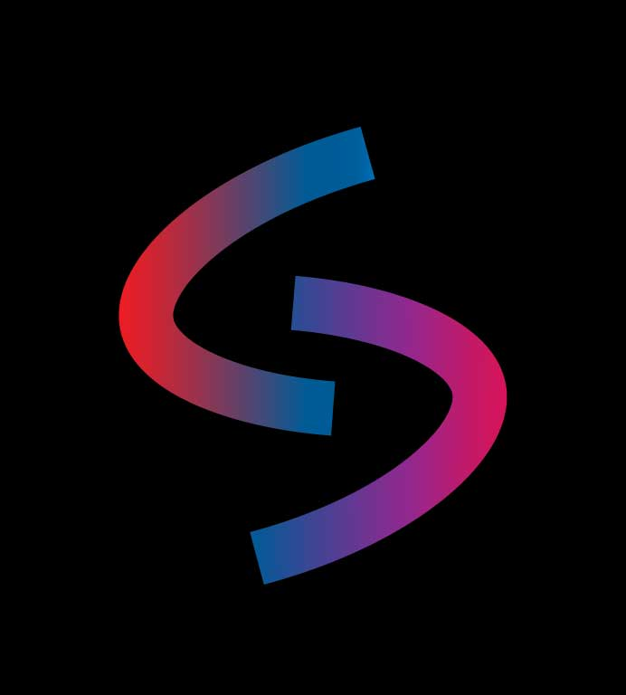

# About my logo

     
 

 
My goal of this logo is to form a personal brand in which it is easy to identify me. I chose the `S` for many reasons but the main one is for my middle name sundar, I also gave it shape with these signs that are widely used in html `<>`, as for the colors was a taste for the colors I use most when programming and somehow I feel identified.
## Colors

| HEX | RGB |  |
| ---       | ---             |---
| `#005c9b` | `RGB(0,92,155)` |
 
|
| `#dc202d` | `RGB(220, 32, 45)`|
 
|
| `#7c3092` | `RGB(124, 48, 146)` |
 
|
| `#d1165d` | `RGB(209, 22, 93)` |
 
|